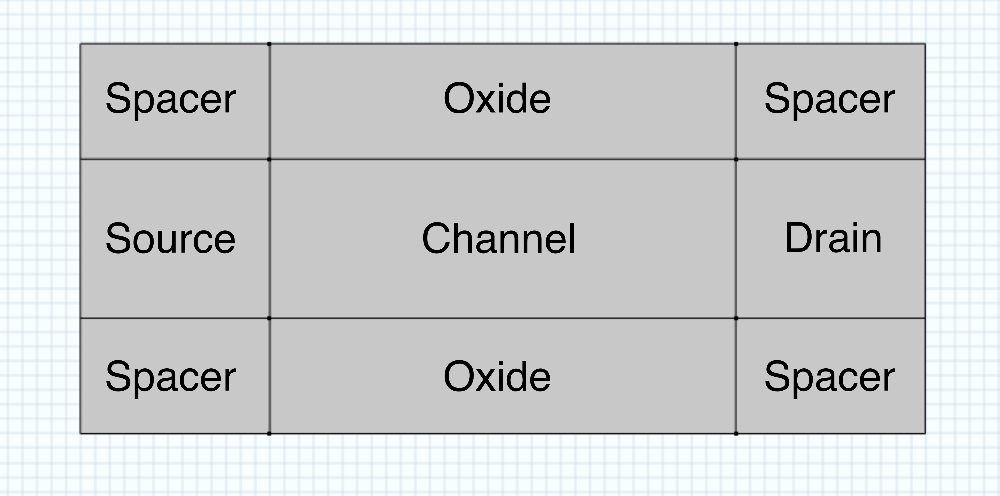

# Active Region {#channel_region}

The active region is consisted of a source, drain, channel, oxide, and spacer regions. While the oxide and spacer layers are all separate rectangles, the channel, source, and drain regions are all encapsulated in a single rectangle entity, separated by mesh control lines.

**Parent topic:**[Geometry](geometry.md)

