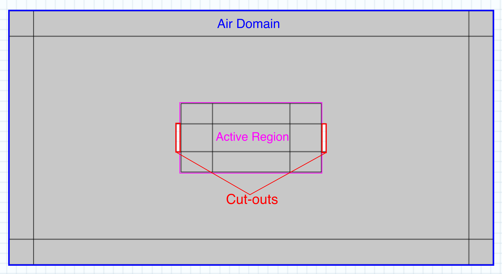

# Air Domain {#air_domain}

The air domain that surrounds the active region is a simple 100 nm x 50 nm rectangle that acts as the background layer to the active device region. The [infinite element domain](https://doc.comsol.com/5.5/doc/com.comsol.help.comsol/comsol_ref_definitions.12.116.html) function in COMSOL is used to model the numerical behaviors of this domain.

Initially, several domains are used for testing purposes, these domains are no longer used.

Two cut-outs had to be constructed beside the source and drain contacts to allow boundary conditions to be properly applied.

**Parent topic:**[Geometry](geometry.md)

