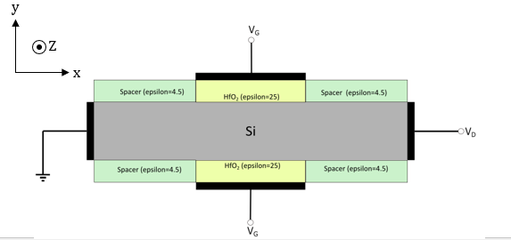

# Quantum Confinement Correction {#quantum_confinement}

The fin of the FinFET is extremely thin, which results in a quantum well like system. This well energetically and spatially confines the charge within the channel, which results in changes to the concentration and spatial distribution of free charges within that is unaccounted for in a purely classical drift-diffusion formulation. To account for this change, the modified local density approximation \(MLDA\) has been used, which shows good conformation with more accurate Schrödinger-Poisson formulations as shown [here](https://ieeexplore.ieee.org/abstract/document/8625699).

The MLDA formulation is a modification to the density of states, which is used to compute charge. Typically, charge in a system governed by the Fermi-Dirac distribution can be calculated as follows:

where is the density of available electron per energy, and is the Fermi-Dirac distribution.

Typically, the density of states in a 3-D unconfined system is as follows

where is the reduced Planck's constant, is the electron effective mass, and is the conduction band edge

In the MLDA formulation, the density of state function is formulated as follows

where is the distance to the semiconductor-insulator interface at , and effective masses are defined in the table below for Si

|Valley|||||
|------|---|---|---|---|
|\[1 0 0\]|0.196|0.196|0.914|0.196|
|\[0 1 0\]|0.196|0.914|0.196|0.914|
|\[0 0 1\]|0.914|0.196|0.196|0.196|

The device is assumed to have the following orientation, along with a wafer direction of \[1 0 0\], *i.e.*, \[1 0 0\] in the direction of the fin height \(\)

-   **[Implementation of Quantum Confinement](implementation_of_quantum_confinement.md)**  

-   **[Custom Functions](custom_functions.md)**  

**Parent topic:**[Simulation Setup](simulation_setup.md)

**Related information**  

[Implementation of Quantum Confinement](implementation_of_quantum_confinement.md)

[Custom Functions](custom_functions.md)

